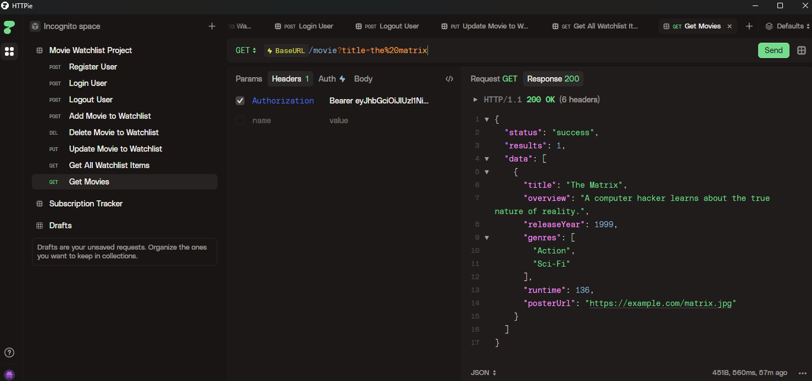
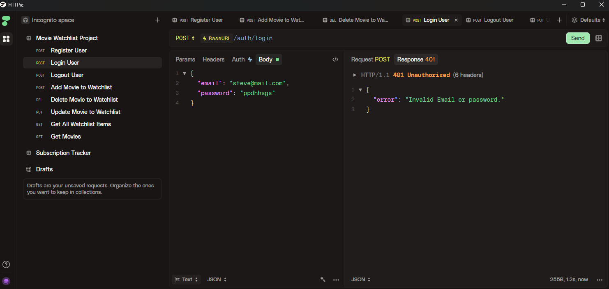
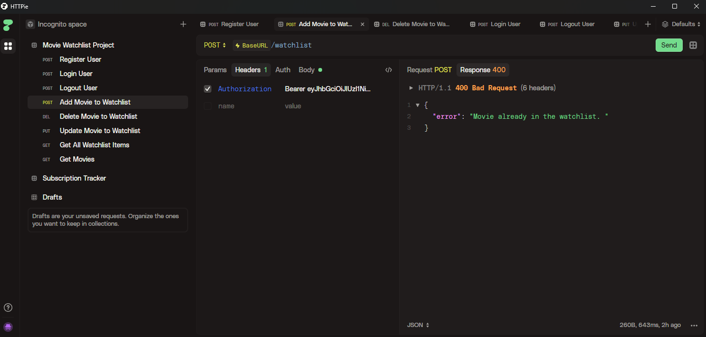

## Project Overview 📋

This project implements a backend for a movie management application, exposing a RESTful API built with **Node.js and Express**.

It allows users to register and authenticate securely using **JSON Web Tokens (JWT)**, with passwords protected through **bcrypt hashing.** Once authenticated, users can manage their personal watchlist through full **CRUD operations** (create, read, update, and delete).

Also the users can do the following things:

- Register an account, log in and log out. 
- Save movies to their personal list
- Update their watch status (e.g, *planned*, *watching*, *completed*)
- Add personal ratings and notes
- Remove movies from their watchlist
- Search a movie by its *title*, *type of genre* and *release year.*

The project also implements:

- **Request data validation**
- **Route protection using authentication middleware**
- **Centralized error handling**
- **Database migrations**

Database interaction is handled using **Prisma ORM** with **Neon Serverless PostgreSQL**, following modern backend development practices aimed at building **production-ready applications**.

### Tech Stack 🔧

- **Node.js** – JavaScript runtime for server-side development.
- **Express.js** – Fast, minimalist web framework for Node.js
- **JWT (JSON Web Tokens) **– Secure authentication and authorization.
- **Prisma** – Next-generation ORM for database management.
- **PostgreSQL** – Powerful, open-source relational database
- **Zod** – TypeScript-first schema validation library.
- **bcryptjs** – Password hashing for secure user authentication.
- **dotenv** – Environment variable management.

### All Features

## Authetication System: 🔑
- User Registration - Secure user signup with email validation.
- User Login - JWT-based authentication with token generation.
- User Logout - Token invalidation and session management.
- Password Hashing - Secure password storage using bcryptjs.
- Protected Routes - Middleware-based route protection.

## Movie Management 🎬 
- CRUD Operations - Create, read, update, and delete movies.
- Movie Details - Store title, overview, release year, genres, runtime, and poster URLs.
- Query Support - Filter and search movie data.

## Additional Features 🌱
- Request Validation - Zod schema validation for all endpoints.
- Error Handling - Centralized error handling middleware.
- JWT Middleware - Automatic token verification for protected routes.
- Database Migrations - Prisma migrations for schema management.
- Database Seeding - Seed script for initial data.

### Previews Project
HTTPie Client to do the requests and receive the responses from the server. 
- Searching a movie by its title.

- Validation of password and email.

- Bad request to add a movie that already exists in the watchlist's user. 

